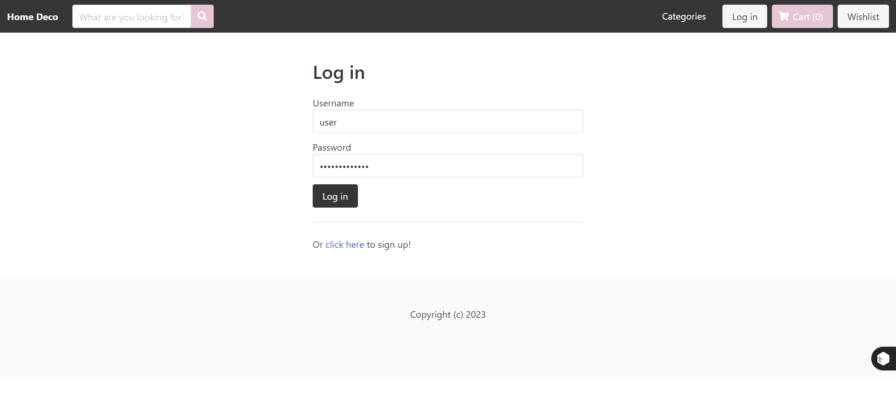

# 🌟 Home Deco - Ecommerce Website  
**#ecommerce-website-djaorestfullapi-vue-stripe**  

**Welcome to Home Deco!**  
A sleek, modern e-commerce platform designed for home decoration enthusiasts. Built using cutting-edge technologies, **Home Deco** offers a seamless shopping experience with powerful tools for customers and admins alike.  

### 🚀 Technologies Behind Home Deco  
- **🔧 Django REST Framework**: A robust and scalable backend API.  
- **🎨 Vue.js**: Dynamic, responsive, and user-friendly frontend.  
- **💳 Stripe**: Secure and efficient payment processing.  

---

## 🎯 Key Features  

### 🔒 **User Authentication**  
- Hassle-free login and logout for customers and admins.

### 🛒 **Main Page**  
- **Explore**: Browse a variety of home decor items by category.
    
- **Details**: Dive into detailed product descriptions and images.  
- **Wishlist & Cart**: Save your favorites or prepare your cart for checkout.  

### 💰 **Payment Integration**  
- **Stripe Payments**: Fast, secure, and reliable transactions.  
- **How it works**:  
  1. Enter payment details (e.g., credit card).  
  2. Instantly receive an **invoice**.  
  3. A confirmation message assures you: "Your payment will be processed within 24 hours."  

### 📊 **Admin Panel**  
- **Product Management**: Add, edit, and categorize products with ease.  
- **Performance Insights**: View sales performance through interactive graphs and metrics for data-driven decisions.  
